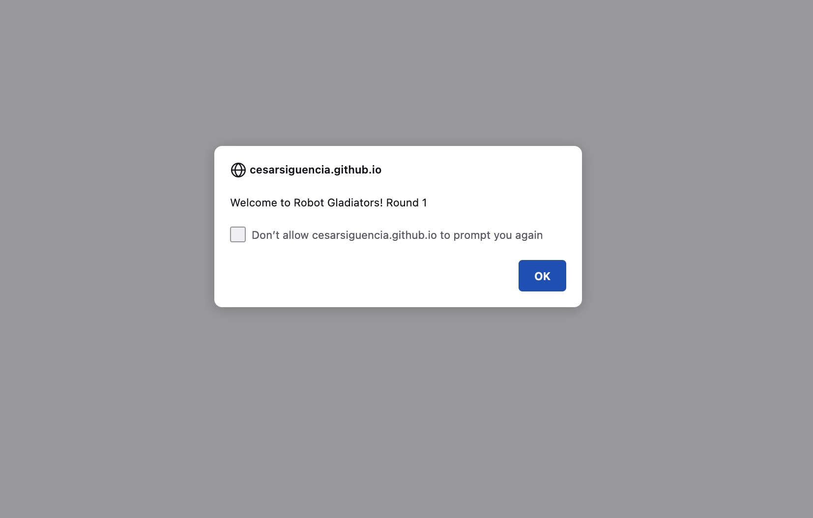
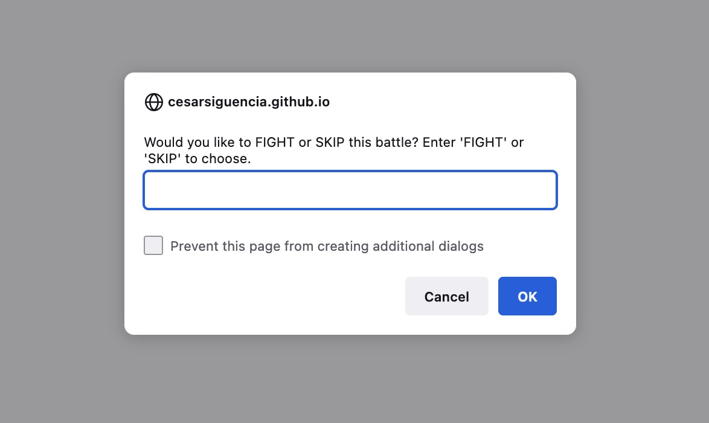

# Robot Gladiators by CS

This is a simple game built using vanilla JS. It is one of my first JS projects, which explains the simplicity of the UI. 

How do you win? The user must stay above 0 points as you defeat each of the three computer robots. Type ‘FIGHT’ each time you wish to fight the computer robot. Each party will lose points per fight, but the robot’s attack varies at random per fight, so be careful! 

If the user wins the battle, they will earn money and be redirected to the store where they can ‘REFILL’ their health by 20 points, ‘UPGRADE’ their attack damage by 6 points, or move on to the next round. 

If the robot wins, the user will have no points and the user will be unable to move on to the next robot. Their high score will be saved after losing the game.

Enjoy!

